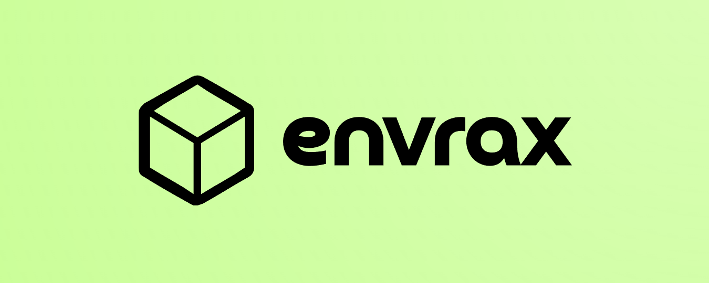

---
hide:
  - navigation
---

*Envrax, a Gymnasium-style API standard for Reinforcement Learning environment creation in JAX.*

---

    <a href="/" target="_blank" style="text-align: center;">
        <svg xmlns="http://www.w3.org/2000/svg" height="32" width="28" viewBox="0 0 448 512"><path fill="rgba(255, 255, 255, 0.7)" d="M96 0C43 0 0 43 0 96V416c0 53 43 96 96 96H384h32c17.7 0 32-14.3 32-32s-14.3-32-32-32V384c17.7 0 32-14.3 32-32V32c0-17.7-14.3-32-32-32H384 96zm0 384H352v64H96c-17.7 0-32-14.3-32-32s14.3-32 32-32zm32-240c0-8.8 7.2-16 16-16H336c8.8 0 16 7.2 16 16s-7.2 16-16 16H144c-8.8 0-16-7.2-16-16zm16 48H336c8.8 0 16 7.2 16 16s-7.2 16-16 16H144c-8.8 0-16-7.2-16-16s7.2-16 16-16z"/></svg>
        
Docs

    </a>
    <a href="https://github.com/Achronus/envrax/" target="_blank"  style="text-align: center;">
        <svg xmlns="http://www.w3.org/2000/svg" height="32" width="28" viewBox="0 0 640 512"><path fill="rgba(255, 255, 255, 0.7)" d="M392.8 1.2c-17-4.9-34.7 5-39.6 22l-128 448c-4.9 17 5 34.7 22 39.6s34.7-5 39.6-22l128-448c4.9-17-5-34.7-22-39.6zm80.6 120.1c-12.5 12.5-12.5 32.8 0 45.3L562.7 256l-89.4 89.4c-12.5 12.5-12.5 32.8 0 45.3s32.8 12.5 45.3 0l112-112c12.5-12.5 12.5-32.8 0-45.3l-112-112c-12.5-12.5-32.8-12.5-45.3 0zm-306.7 0c-12.5-12.5-32.8-12.5-45.3 0l-112 112c-12.5 12.5-12.5 32.8 0 45.3l112 112c12.5 12.5 32.8 12.5 45.3 0s12.5-32.8 0-45.3L77.3 256l89.4-89.4c12.5-12.5 12.5-32.8 0-45.3z"/></svg>
        
Code

    </a>

---

Envrax is a lightweight open-source JAX-native Reinforcement Learning (RL) environment API standard for single-agents, equivalent to the [Gymnasium](https://github.com/Farama-Foundation/Gymnasium) package. It includes: base classes, spaces, wrappers, and a shared registry for building and utilizing RL environments with ease.

All environment logic follows a *stateless functional design* that builds on top of the [JAX](https://github.com/jax-ml/jax) and [Chex](https://github.com/google-deepmind/chex) packages to benefit from JAX accelerator efficiency.

## Why Envrax?

One of the downsides of RL research is sample efficiency. Often the environment becomes the main bottleneck for model training because it's restricted, and built, around CPU utilisation.

For example, the [Atari](https://ale.farama.org/) suite is CPU constrained and, from our experience, when we increase the number of environments running in parallel, a single training step drastically increases wall-clock time. Gradient computations on a GPU could take ~30 seconds but the sample retrieval takes over 2+ minutes (400% increase) because of the CPU bottleneck and that's with efficiency tricks!

This begged a much deeper question -

> what if we could eliminate the CPU bottleneck by loading the environment onto the same accelerator as the model?

Packages like [Brax](https://github.com/google/brax) and [Gymnax](https://github.com/RobertTLange/gymnax/) have shown the incredible benefits of JAX based environment approaches. However, they are limited to their unique approaches without a unified API standard. Gymnasium has always been a personal favourite of mine because of its API simplicity, but there is no JAX equivalent. Thus, Envrax was born.

-   :material-rocket-launch:{ .lg .middle } **Getting Started**

    ---

    What are you waiting for?!

    [:octicons-arrow-right-24: Get Started](starting/index.md)

-   :material-scale-balance:{ .lg .middle } **Open Source, MIT**

    ---

    Envrax is licensed under the MIT License.

    [:octicons-arrow-right-24: License](license.md)

